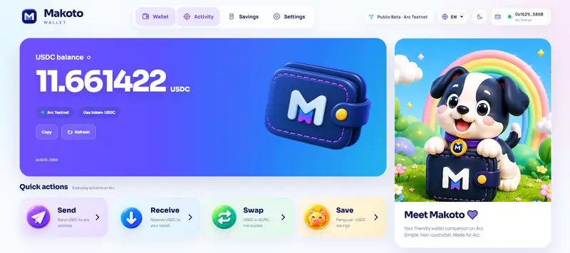
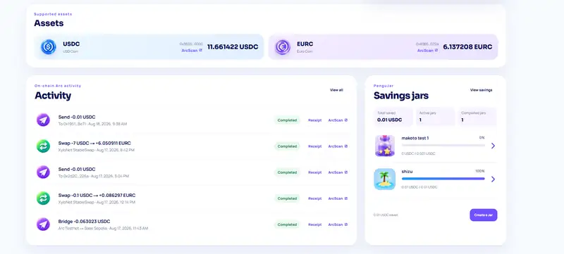
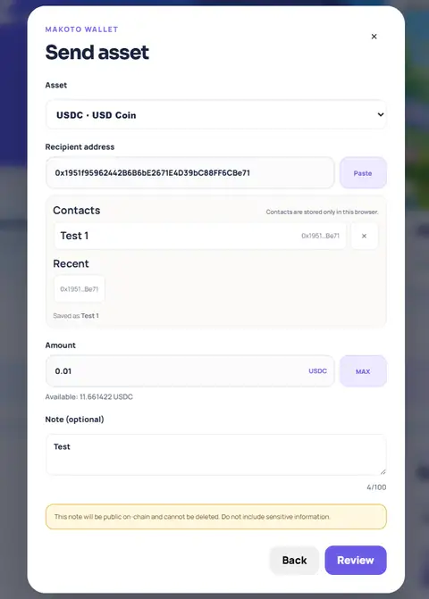
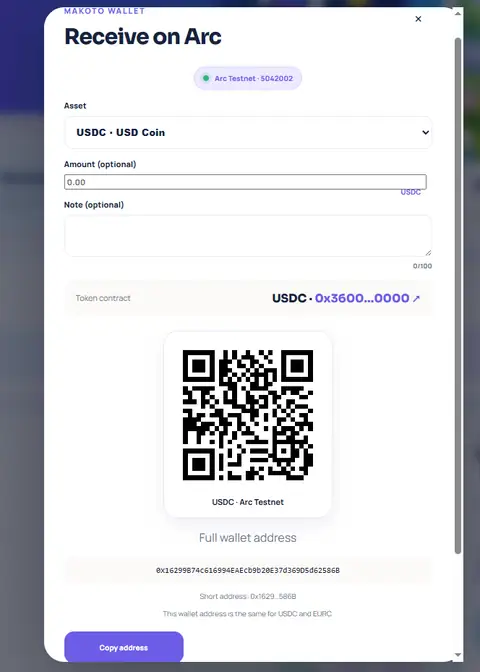
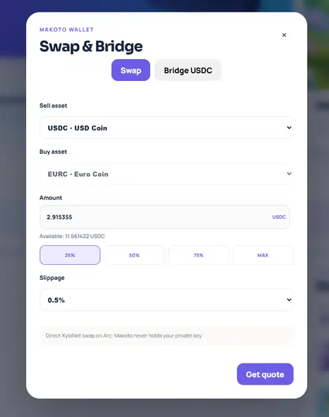
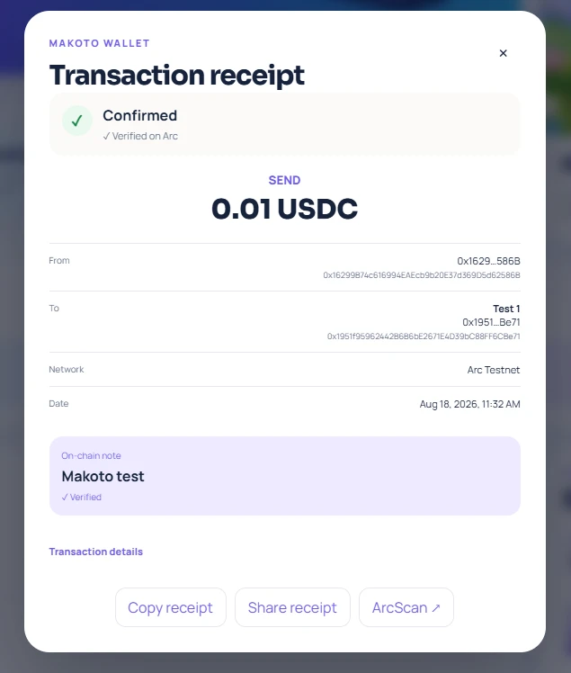
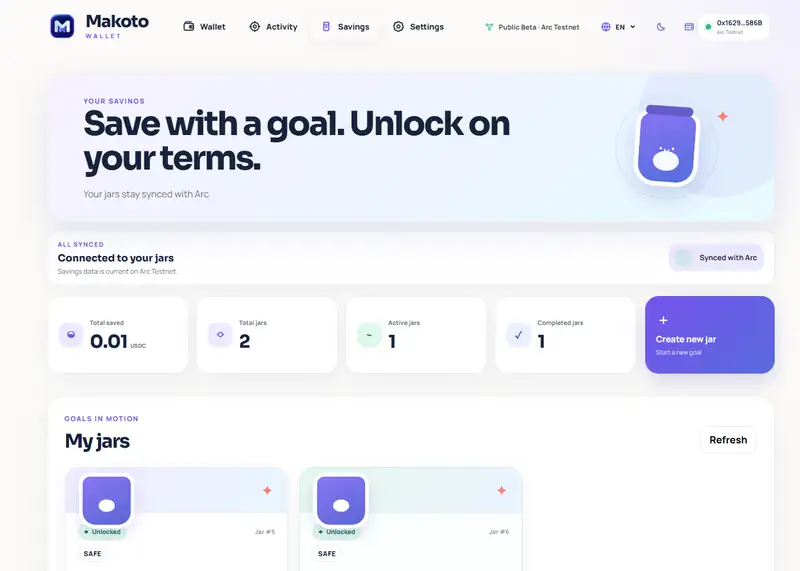

# Makoto Wallet

<p align="center">
  
</p>

<p align="center">
  <strong>A non-custodial Arc Testnet wallet experience.</strong><br />
  USDC/EURC payments, swaps, bridging, savings, transaction memos, and verifiable transaction history.
</p>

<p align="center">
  <a href="https://makoto-wallet.vercel.app"><strong>Open Makoto Wallet</strong></a>
  ·
  <a href="https://testnet.arcscan.app/address/0x2d2C30ACe5d1f057C6eC2e2E8219A43355Dd226a">PenguJar V3 on ArcScan</a>
</p>

---

## Overview

Makoto Wallet is a client-side, non-custodial wallet experience built for **Arc Testnet**. It supports everyday USDC and EURC payments, real XyloNet swaps, Circle CCTP V2 bridging, PenguJar savings, public Arc transaction memos, and receipts verified against on-chain transaction logs.

The project started as **PenguJar**, an on-chain USDC savings dApp. PenguJar V3 is now the savings module inside the broader Makoto Wallet product.

> Makoto Wallet is a testnet product for development, testing, and demonstration. Testnet assets have no intended real-world monetary value. The project is not independently security audited or represented as mainnet-ready financial software.

## Live App

- **Deployment:** https://makoto-wallet.vercel.app
- **Network:** Arc Testnet
- **Production branch:** `makoto-wallet`

## Product Preview

<p align="center">
  
</p>

<p align="center">
  <strong>Dashboard</strong> — USDC/EURC balances, quick actions, Arc Testnet status, and the Makoto wallet experience.
</p>

<p align="center">
  
</p>

<p align="center">
  <strong>Assets & on-chain activity</strong> — real Arc activity with Send, Swap, Bridge, receipts, and PenguJar savings status.
</p>

<table>
  <tr>
    <td width="33%" align="center">
      
      <br /><strong>Send</strong><br />
      Contacts, Recent recipients, and optional on-chain Memo.
    </td>
    <td width="33%" align="center">
      
      <br /><strong>Receive</strong><br />
      Client-side QR payment requests for supported assets.
    </td>
    <td width="33%" align="center">
      
      <br /><strong>Swap</strong><br />
      XyloNet USDC ↔ EURC with 25%, 50%, 75%, and MAX controls.
    </td>
  </tr>
</table>

<p align="center">
  
</p>

<p align="center">
  <strong>Verified transaction receipts</strong> — transaction details are checked against Arc receipt logs, with matching on-chain Memo verification when present.
</p>

<p align="center">
  
</p>

<p align="center">
  <strong>PenguJar Savings</strong> — goal-based USDC savings integrated directly into Makoto Wallet.
</p>

## Current Features

### Wallet

- Reown AppKit multi-wallet connection
- Email and Google embedded-wallet onboarding with a Makoto-owned OTP guidance step
- Injected wallets, WalletConnect, and mobile wallet deep links
- Arc Testnet detection
- Real USDC and EURC balances
- Send USDC and EURC
- Browser-local Contacts and Recent recipients
- Address QR and ERC-681 token payment-request QR
- Optional receive amount and display-only receive note
- Optional Arc on-chain transaction Memo for Send
- Verified transaction receipts
- Real ArcScan/Blockscout on-chain Activity for Send, Receive, Swap, and Bridge

### Safety and local security

- Transaction Safety Review before supported write actions, with account/network/input invalidation
- Successful-receipt verification before confirmed UI and non-blocking background data refresh
- Security Center for deterministic wallet, network, PenguJar, privacy, and beta-status information
- Optional browser-local Makoto App Lock with a six-digit PIN verifier, inactivity lock, cooldown, and cross-tab locking
- Optional **Keep unlocked for this browser session** convenience for reloads and other live Makoto tabs

App Lock restricts the normal Makoto interface on the current browser. By default, reloads and new tabs require the PIN. When the optional browser-session convenience is enabled, an authenticated session can survive reloads and be shared with another live Makoto tab. Manual Lock Now and inactivity auto-lock override that convenience. App Lock does not encrypt or control wallet private keys, replace Reown or external-wallet security, or make browser storage a hardware security boundary.

### Swap

- Real XyloNet StableSwap USDC ↔ EURC swaps
- Exact token approval when required
- Deadline and slippage protection
- 25%, 50%, 75%, and MAX quick amount controls using exact bigint arithmetic

### Bridge

- Circle CCTP V2 Forwarding Service
- Arc Testnet → Base Sepolia USDC route
- The connected wallet remains the destination wallet
- Activity and receipts confirm the Arc-side transaction; they do not claim destination mint or finalization unless proven by available data

### Savings — PenguJar V3

- Goal-based USDC savings jars
- SAFE and SHIELDED modes
- PUBLIC and PRIVATE metadata modes
- Time-locked withdrawals
- Guardian protection
- Recovery Wallet support
- Guardian-assisted owner recovery
- Delayed guardian replacement and recovery protections
- Defensive withdrawal freeze flow
- Client-side encrypted private metadata

### User Experience

- English and Vietnamese
- Light and Dark themes
- Responsive desktop and mobile layouts

## Current Feature Status

| Feature | Status |
| --- | --- |
| Reown/AppKit wallet connection | ✅ Available |
| Email / Google embedded-wallet onboarding | ✅ Available |
| Arc Testnet detection | ✅ Available |
| Real USDC and EURC balances | ✅ Available |
| Send and Receive USDC / EURC | ✅ Available |
| Contacts & Recent recipients | ✅ Available |
| Receive QR payment requests | ✅ Available |
| Arc transaction Memo | ✅ Available |
| Verified transaction receipts | ✅ Available |
| ArcScan/Blockscout on-chain Activity | ✅ Available |
| XyloNet USDC ↔ EURC Swap | ✅ Available |
| Swap quick amount controls | ✅ Available |
| Arc → Base Sepolia CCTP V2 Bridge | ✅ Available |
| PenguJar V3 savings | ✅ Available |
| PUBLIC / PRIVATE jar metadata | ✅ Available |
| Guardian & Recovery Wallet | ✅ Available |
| Transaction Safety Review | ✅ Available |
| Security Center | ✅ Available |
| Optional local App Lock | ✅ Available |
| Browser-session App Lock convenience | ✅ Available |
| EN / VI and Light / Dark | ✅ Available |
| Mainnet release | ⏳ Not released |

## Arc Testnet Configuration

| Item | Value |
| --- | --- |
| Network | Arc Testnet |
| Chain ID | `5042002` |
| RPC | `https://rpc.testnet.arc.network` |
| Explorer | `https://testnet.arcscan.app` |
| Gas token | USDC |
| Arc Testnet USDC | `0x3600000000000000000000000000000000000000` |
| Arc Testnet EURC | `0x89B50855Aa3bE2F677cD6303Cec089B5F319D72a` |
| PenguJar V3 | `0x2d2C30ACe5d1f057C6eC2e2E8219A43355Dd226a` |
| V3 deployment block | `56927475` |
| USDC / EURC decimals | `6` |

PenguJar V3 is verified on [ArcScan](https://testnet.arcscan.app/address/0x2d2C30ACe5d1f057C6eC2e2E8219A43355Dd226a#code).

## Architecture

Makoto Wallet is a client-side dApp. It does not require a custodial backend to hold user funds or signing credentials. Public reads use Arc Testnet data sources; the connected wallet signs every write operation.

### Frontend

- Next.js 16.3 and React 19
- TypeScript
- wagmi 3 and viem 2
- Reown AppKit
- TanStack Query 5
- Responsive Makoto Wallet UI

### Smart Contracts

- Solidity and Hardhat
- OpenZeppelin contracts
- PenguJar V3 on Arc Testnet

### Contacts

Contacts are browser-local, scoped by connected wallet and chain, and have no cloud synchronization. Contact names are display metadata and are excluded from canonical shared receipt text.

### App Lock and local data

Makoto App Lock stores a salted PBKDF2-SHA-256 verifier and local lock settings, never the raw PIN. It gates Makoto's normal UI without disconnecting or authenticating the wallet. Its optional browser-session convenience uses ephemeral session state: reloads can remain unlocked, and another live Makoto tab can request access from an already authenticated tab. Manual and inactivity locks clear that convenience. This does not change wallet custody or private-key security. Contacts, Recent recipients, and optimistic Activity remain browser-local; PRIVATE PenguJar metadata retains its separate wallet-signature-derived encryption architecture.

### Receive Payment Requests

Receive QR codes are generated client-side. Makoto supports a plain address QR and an ERC-681 token payment request with an optional amount. The optional note is display metadata and is not injected as arbitrary non-standard ERC-681 data.

### Arc Transaction Memo

An optional Send note uses the Arc Memo contract and is public on-chain. A Send without a note remains a direct ERC-20 transfer. Memo-wrapped sends currently require an EOA-compatible wallet on Arc; removing the note preserves the normal direct-transfer path.

### Real Swap

Makoto executes USDC ↔ EURC swaps through XyloNet StableSwap. Quotes are short-lived and include deadline and slippage protection. When required, the connected wallet signs an exact-amount token approval before separately signing the swap.

### CCTP Bridge

Makoto bridges USDC from Arc Testnet to Base Sepolia through Circle CCTP V2 Forwarding Service. The destination is the same connected wallet. The application does not overstate destination mint or finalization tracking.

### Activity and Verified Receipts

Wallet Activity is derived from ArcScan/Blockscout on-chain transfer data. PenguJar Activity uses a constrained same-origin API with indexed event filtering, bounded requests, incremental refresh, deduplication, and RPC failover. The receipt viewer independently reads the real transaction receipt and verifies the transaction hash, successful status, block, token contract, amount, direction, addresses, and relevant log indices. Swap verification requires both legs; Bridge receipts confirm the Arc-side transaction; matching Arc Memo events are bound through their sender, target, and inner transfer calldata hash.

## Security Model

- Makoto does not store wallet private keys
- The connected wallet reviews and signs transactions
- Wallet signing secrets must never be placed in frontend environment variables
- Contacts are browser-local and are not cloud-synchronized
- Receive QR codes are generated client-side
- Arc Memo notes are public and permanent on-chain data
- Verified receipts read real transaction receipt and log data rather than trusting local display data alone
- PenguJar V3 uses `SafeERC20`, reentrancy protection, time locks, and owner authorization
- Guardian controls are defensive and do not directly grant withdrawal rights
- Owner recovery is delayed and approval-gated
- PRIVATE jar metadata is encrypted client-side before local storage

PenguJar V3 has extensive project-level automated and adversarial-path tests, but **has not undergone an independent professional security audit**. Do not treat this repository as audited production financial software.

## Validation

Run the complete validation sequence from the repository root:

```bash
npm ci
npm run compile
npm test

cd frontend
npm ci
npm test
npm run typecheck
npm run lint
npm run build
```

For the Public Beta 0.2 preparation checkpoint, **265/265 frontend tests** and **19/19 required contract tests** pass. TypeScript, ESLint, the production build, and whitespace validation also pass.

Manual QA has been reported complete for the core release flows, including onboarding, supported wallet actions, PenguJar, Security Center, App Lock, English/Vietnamese, themes, and responsive layouts. This is a project QA statement, not evidence of an independent professional security audit or exhaustive testing of every wallet and transaction path.

## Local Development

Requirements:

- Node.js 20 or later
- npm

```bash
git clone https://github.com/congthuat/Makoto-Wallet.git
cd Makoto-Wallet
npm ci

cd frontend
npm ci
cp .env.example .env.local
npm run dev
```

Open `http://localhost:3000`.

On Windows PowerShell:

```powershell
Copy-Item .env.example .env.local
```

## Frontend Environment Variables

The checked-in defaults point to the current Arc Testnet deployment. Public overrides can be supplied when needed:

```dotenv
NEXT_PUBLIC_PENGUJAR_ADDRESS=0x2d2C30ACe5d1f057C6eC2e2E8219A43355Dd226a
NEXT_PUBLIC_ARC_RPC_URL=https://rpc.testnet.arc.network
NEXT_PUBLIC_REOWN_PROJECT_ID=your_reown_project_id
```

`NEXT_PUBLIC_REOWN_PROJECT_ID` enables Reown AppKit wallet selection, WalletConnect QR codes, and mobile wallet deep links. Only public browser configuration belongs in `NEXT_PUBLIC_*` variables.

**Never put `PRIVATE_KEY` or other wallet signing secrets in frontend, GitHub, or Vercel public environment variables.**

## Contract Development

From the repository root:

```bash
npm ci
npm run compile
npm test
```

V3 deployment and verification tooling remains available through the existing root scripts. Deployment commands require deliberate local configuration and a dedicated Arc Testnet wallet.

## Deployment and Repository

- **Vercel URL:** https://makoto-wallet.vercel.app
- **Vercel root directory:** `frontend`
- **Repository:** `congthuat/Makoto-Wallet`
- **Active production branch:** `makoto-wallet`

The `main` branch retains earlier PenguJar project history. Makoto Wallet is developed and deployed from `makoto-wallet`; this housekeeping checkpoint does not rename the repository or merge branches.

## Development Status

The planned Arc Testnet Public Beta roadmap through Phase 10 is complete. Phase 10, **Final Audit & Product Polish**, is complete for the current beta scope.

Project history:

- Phase 1 — Wallet Foundation ✅
- Phase 2 — Mini Wallet Core ✅
- Phase 3 — Real XyloNet Swap ✅
- Phase 4 — Wallet Safety ✅
- Phase 5 — Multi-Asset Wallet ✅
- Phase 6 — Arc-native CCTP integration ✅
- Phase 7 — Public Beta polish and release readiness ✅
- Phase 8 — Everyday wallet UX & verification ✅
  - Contacts and Recent recipients
  - Receive payment QR
  - Arc transaction Memo
  - Verified transaction receipts
  - Swap quick amount controls
- Phase 9 — Onboarding, Security Center, Transaction Safety, and App Lock ✅
- Phase 10 — Final Audit & Product Polish ✅

Development after Phase 10 is feedback-driven rather than phase-number-driven. Future work may respond to:

- real user feedback
- bug reports
- Arc ecosystem changes
- future mainnet-readiness work when officially appropriate

These are directions, not promised releases. Makoto Wallet remains Arc Testnet-only and does not promise Arc Mainnet support.

## Current Public Beta Release

Makoto Wallet Public Beta 0.2 is available on Arc Testnet.

- **Version:** `v0.2.0-beta.1`
- **Release title:** `Makoto Wallet Public Beta 0.2`
- **Release checkpoint:** `f17cb1f497bb7e810291bc58563a98ebf9de8b1d`
- **GitHub Release:** https://github.com/congthuat/Makoto-Wallet/releases/tag/v0.2.0-beta.1
- **Branch:** `makoto-wallet`
- **Deployment:** https://makoto-wallet.vercel.app
- **Status:** Arc Testnet Public Beta pre-release

Current validation:

- Required contract tests: 19/19
- Frontend tests: 265/265
- Typecheck: PASS
- Lint: PASS
- Production build: PASS

Makoto Wallet remains Arc Testnet-only test software. Testnet assets have no intended real-world monetary value. Makoto Wallet and PenguJar have not undergone an independent professional security audit and are not mainnet-ready financial software.

## Previous Releases

### Makoto Wallet Public Beta 0.1

- **Version:** `v0.1.0-beta.1`
- **Release title:** `Makoto Wallet Public Beta 0.1`
- **Release commit:** `44df6a11d71a85774c2b0e4128118a1493c65707`
- **GitHub Release:** https://github.com/congthuat/Makoto-Wallet/releases/tag/v0.1.0-beta.1
- **Branch:** `makoto-wallet`
- **Deployment:** https://makoto-wallet.vercel.app
- **Status:** Arc Testnet Public Beta released

Historical release checks:

- Contract tests: 85 passing
- Frontend tests: 197 passing
- Typecheck: PASS
- Lint: PASS
- Production build: PASS

Manual on-chain QA for this release specifically verified:

- direct USDC Send receipt → Verified on Arc
- Arc Memo Send receipt → Verified on Arc
- matching on-chain note → Verified

This historical release did not claim a full professional audit, mainnet readiness, or manual testing of every possible wallet and transaction path.

## PenguJar Project History

PenguJar was the original project in this repository and remains the contract-backed savings module within Makoto Wallet. Its history includes time-locked savings, privacy modes, Guardian controls, recovery flows, security tests, and Arc Testnet deployment tooling.

## License

This project is available under the [MIT License](LICENSE).

## Disclaimer

Makoto Wallet is deployed on **Arc Testnet** for testing and demonstration. It is not a bank, investment product, exchange, audited custody service, or promise of returns. Testnet assets are not intended to represent real-world monetary value. Users are responsible for reviewing wallet prompts and transaction details before signing.
